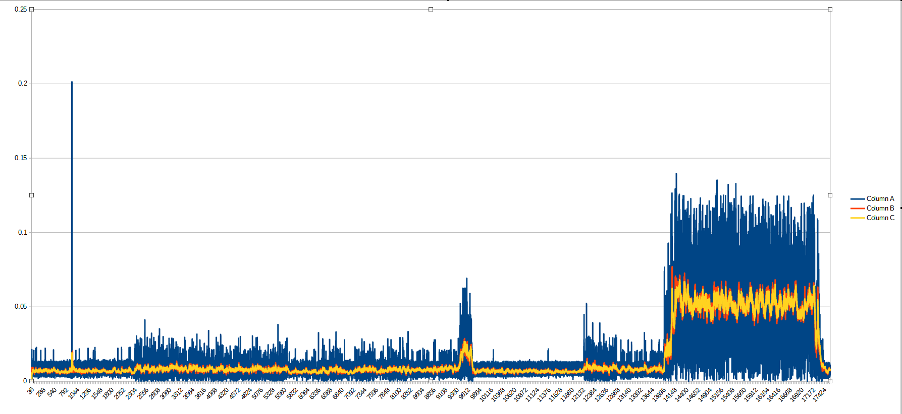

# WashingMachineAntiShake
Washing Machine Anti-Shake Application
This is a C# application designed to run on a Raspberry Pi and pause a washing machine when shaking exceeds a set threshold. 
(Note: Normally you'd just balance the washing machine)

Images of shaking collected and used for development  
Magnitude of shaking:

Visualizing all three axis of movement:

Generating average over time to smooth data:

